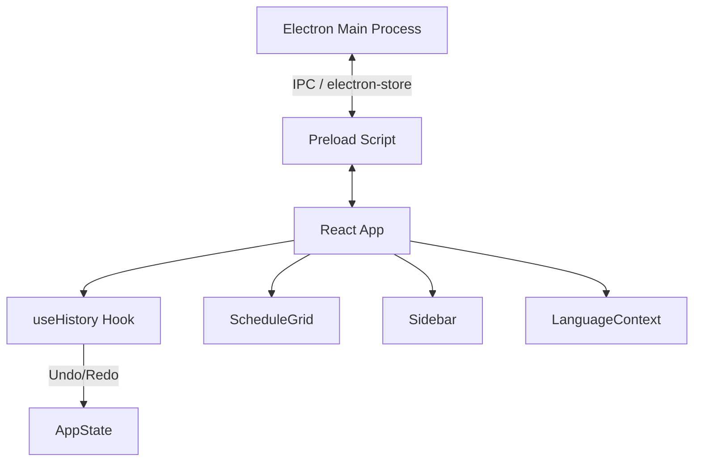

# Wochenplan

A Electron-based weekly planning application designed for maximum visual fluidity and efficiency.
You can download it on the side from the releases or manually set it up and build it.

## Key Features
- **Ultra-Smooth UI**: Optimized transitions and hardware-accelerated animations (60fps+ focus).
- **Persistent Entries**: Smart handling of recurring vs. one-time schedule items.
- **Custom Presets**: Create and manage templates for recurring tasks and entire day schedules.
- **Modern Aesthetics**: Sleek dark mode design with customizable accent colors.
- **Multilingual Support**: Fully localized in German and English with reactive switching.
- **Desktop Ready**: Built with Electron for a native desktop experience.

## Quick Start
1. Install dependencies:
   ```bash
   npm install
   ```
2. Start development server:
   ```bash
   npm run dev
   ```
3. Build for production:
   ```bash
   npm run build
   ```

## Architecture Overview



## Features & Shortcuts

### Workspace Management
- **Persistence**: Data is saved automatically to your local system.
- **Undo/Redo**: Full history stack for every modification.
- **Week Navigation**: Cycle through weeks while maintaining pinned/persistent items.

### Keyboard Shortcuts
| Command | Action |
| --- | --- |
| `Ctrl + Z` | Undo last change |
| `Ctrl + Y` | Redo change |
| `Ctrl + D` | Duplicate selected entries |
| `Delete` | Remove selected entries |
| `Esc` | Close dialogs / Cancel edit |

## Development Deep Dive
The project is split into the **Main Process** (Electron) and the **Renderer Process** (React). 

### GPU Optimizations
We use forced GPU rasterization to ensure the UI remains fluid even with many entries:
```typescript
// electron/main.ts
app.commandLine.appendSwitch('enable-gpu-rasterization');
app.commandLine.appendSwitch('force-gpu-rasterization');
```

## Project Structure
- `electron/`: Native process management and IPC setup.
- `src/components/`: Modular UI (Schedule, Sidebar, Settings).
- `src/hooks/`: Business logic (`useAppLogic`, `useHistory`).
- `src/utils/`: Time math and file export generators.
- `src/types/`: Domain logic definitions.

---
*Refer to [Documentation.md](Documentation.md) for deeper technical implementation details.*
